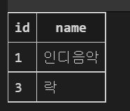

# ORM

Object - Relational - Mapping

- 객체 지향 프로그래밍 언어를 사용하여 호환되지 않는 유형의 시스템 간의 데이터를 변환하는 프로그래밍 기술

- 파이썬에서는 SQLAIchemy, peewee 등 라이브러리가 있으며 Django 프레임워크에서는 내장 Django ORM을 활용 


**객체로 DB를 조작한다.**

```python
Genre.objects.all()

#select * from Genre 와 같은 의미
```


### 모델 설계 및 반영

1. 클래스를 생성하고 원하는 DB구조를 만듬
2. 클래스 내용으로 데이터베이스에 반영하기 위한 마이그레이션 파일을 생성한다.
3. DB에 migrate

```python
#1
class Genre(models.Model):
    name = models.Charfield(max_length = 30)
    
#2
manage.py makemigrations

#3 
manage.py migrate
```


**Migration**

- model에 생긴 변화를 DB에 반영하기 위한 방법
- 마이그레이션 파일을 만들어 DB 스키마를 반영한다.
- 명령어
  - makemigrations : 마이그레이션 파일 생성
  - migrate : 마이그레이션을 DB에 반영

**데이터베이스 조작(Datebase API)**

Genre.objects.all() -> class name.manager.Queryset API


## ORM 기본 조작

### Create

```python
#1. create 메서드 활용
Genre.object.create(name='발라드')

#2 인스턴스 조작
genre = Genre()
genre.name = '인디밴드'
genre.save()
```


### Read

```python
# 1. 데이터 전체 조회
Genre.objects.all()
#<QuerySet [<Genre: Genre object (1)>, <Genre: Genre object (3)>]>

#2. 일부 데이터 조회 get
Genre.objects.get(id=1)
#<Genre: Genre object (1)>  값이 1개(Primary Key), 값이 없거나 많으면 오류 출력

#3. 일부데이터 조회 filter
Genre.objects.filter(id=3)
#<QuerySet [<Genre: Genre object (3)>]>
```


### Delete

```python
# 1. genre 객체 활용
genre = Genre.objects.get(id = 4)
# 2. genre 객체 삭제
genre.delete()
#(1, {'db.Genre': 1})
```


### Table

