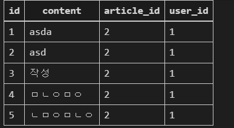

# article_comment_create

articles/detail.html에 화면 구성

조금은 복잡할 수 있지만 차근차근 가보자~~


urls.py

```py
path('<int:pk>/comments/', views.comment_create, name='comment_create'),
```


views.py

```py
def comment_create(request,pk):
    article =Article.objects.get(pk=pk)     		# pk로 글을 식별
    comment_form = CommentForm(request.POST)		# 커맨트 폼에 요청정보를 받음
    if comment_form.is_valid():						# 유효하면 
        comment = comment_form.save(commit=False)	# 저장을 하기전에 comment에 FK값을 넣어야한다.
        comment.article = article					
        comment.user = request.user
        comment.save()  							# comment의 FK인 article,user 입력 후 저장
   
    return redirect('articles:detail', article.pk)
```

뷰에서 detail에 comments라는 값을 넘겨주어야 

반복문으로 댓글을 db에서 뽑아올 수 있음

```py

def detail(request, pk):
    article = Article.objects.get(pk=pk)
    comment_form = CommentForm()
    context={
        'article':article,
        'comment_form':comment_form,
        'comments':article.comment_set.all() # 이부분 추가 ( 역참조를 이용함.)
    }
    return render(request,'articles/detail.html',context)
```

역참조 - `article.comment_set.all()`



article_comment에 있는 comment_set을 전부 받아온다는 이야기.


detail.html

```py

  # 댓글 추가
  <h3 class='my-5'>
    댓글
  </h3>
   				# 댓글이 있다면 개수 출력
  {{ comments.count }}
  
    
    # 로그인이 되었다면 댓글을 작성할 수 있다.
    <form action="" method="POST">
      
      
      <div class='d-flex justify-content-end'>
        <input type="submit" value='글 작성' class='btn btn-success my-1'>
      </div>
    </form>
  

   
    # detail view에서 context으로 넘겨 받은 comments에 있는 요소를 반복문을 통해 출력 !!!
    <div>
      <p>
        {{ comment.user.username }}님 #
      </p>
      <p>{{ comment.content }}</p>
    </div>

  

```


