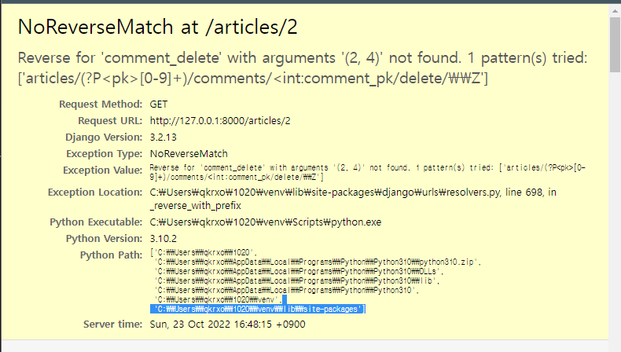

# articles_comment_delete

urls.py

```py
path('<int:pk>/comments/<int:comment_pk/delete/',views.comment_delete,name='comment_delete'),
```

몇번 글에 몇번 댓글인지 받아오는 것


views.py

```py
def comment_delete(request,pk,comment_pk):
    comment = Comment.objects.get(pk = comment_pk)
    if request.user == comment.user: # 댓글 작성한 사람만 지울 수 있음
        comment.delete()
    return redirect('reviews:detail',pk)
```


template에서 삭제 버튼 및 분기 처리!!

```django


  
  
  <a href=""> 삭제</a>
  
    <div>
      <p>
        {{ comment.user.username }}님
      </p>
      <div>
        <span>{{ comment.content }}</span>
      </div>
    </div>

  
```


에러 




pk를 받지 못하는 상황임을 알수 있음 

원인: view에서 pk를 넘겨주지 않았거나 name 오타 / 등등 있을 수 있지만  comment_pk 끝에 > 닫아주지 않아서 생긴 오류였다...

```py
path('<int:pk>/comments/<int:comment_pk/delete/',views.comment_delete,name='comment_delete'),
```

 