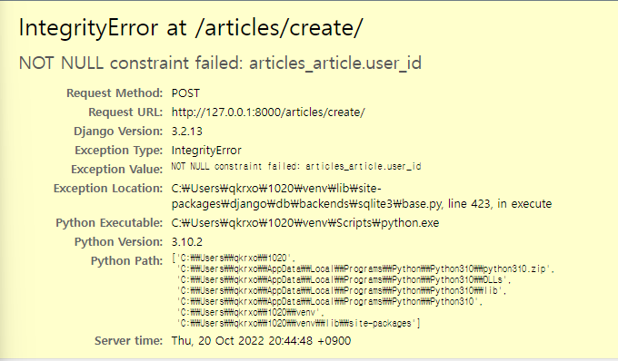

# article_create

1. url

   1. ```py
      path("create/",views.create, name="create"),
      ```

view

```py
def create(request):
    if request.method == 'POST':
        article_form = ArticleForm(request.POST)
        if article_form.is_valid():
            article = article_form.save(commit=False) # 저장 멈추고
            article.user = request.user 
            #article에 user(FK)값 정보를 따로 처리해야한다.
            article.save()
            return redirect('articles:index')
    else:
        article_form=ArticleForm()
    context = {
        'article_form':article_form
    }
    return render(request,'articles/create.html',context)
```

create.html

```py



  <h1>
    글 작성
  </h1>
  <form action="" method='POST'>
    
      #view에서 설정한 폼을 쓰는 것
    <input class='btn btn-success float-end' type="submit" value='작성'>
  </form>

```


article.user = request.user  코드가 없을 때 에러 

 