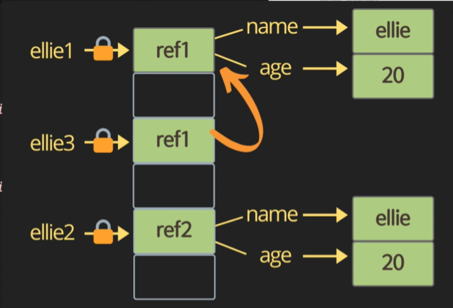

# Js_operator


###  String concatenation

```js
console.log('my'+' cat');
console.log('1'+ 2);
console.log(`string literals: 1 + 2 = ${1+2} ` );

console.log(1 + 1);  
console.log(1 - 1);  // substract
console.log(1 / 1);  //divide
console.log(1 * 1);  //multiply
console.log(5 % 2);  //remainder
console.log(2 ** 3); // exponentiation   
```


### increment and decrement operators

```js
let counter = 2;
const preincrement = ++counter;   
console.log(`preincrement: ${preincrement}, counter:${counter}`)
//preincrement: 3, counter:3

const postincrement = counter++;    // 할당을 먼저 하고 증가
console.log(`postincrement: ${postincrement}, counter:${counter}`)
//postincrement: 3, counter:4

const predecrement = --counter;   
console.log(`predecrement: ${predecrement}, counter:${counter}`)
//predecrement: 3, counter:3

const postdecrement = counter--;   
console.log(`postdecrement: ${postdecrement}, counter:${counter}`)
// postdecrement: 3, counter:2

```


### Assignment operators

```js
let x = 3;
let y = 6;
x += y; // x= x+y 
x -= y;
x *= y;
x /= y;
```


### Comparison operators  작다 작거나 같다 크다 크거나같다.

```js
console.log(10 < 6);  
console.log(10 <= 6);  
console.log(10 > 6);  
console.log(10 >= 6);  
```


### Logical operators : || or, && and, ! not

```js
const value1 = false;
const value2 = 4 < 2 ;
// or
console.log(`or:${value1 || value2 || check()}`);
// check같은 함수를 통한 비교는 가장 뒤에 배치하는 것이 속도측에서 유리하다.

// and
console.log(`or:${value1 && value2 && check()}`);

// not 
console.log(!value1); //값을 반대로 리턴함 false->true

function check(){
    for (let i = 0; i < 10; i++) {
        //wasting time
        console.log('nooo~!!');
    }
    return true
}
```


### Equality

```js
const srtingFive = '5';
const numberFive = 5;

// ==  타입을 변경해서 검사함 즉 타입이 달라도 같다고 나옴
console.log(srtingFive == numberFive );
console.log(srtingFive != numberFive );

// === 타입도 함깨 비교해준다. 비교할 때 이거 사용하는게 좋음 
console.log(srtingFive === numberFive );
console.log(srtingFive !== numberFive );

// object equality by reference
const ellie1 = {name:'ellie'};
const ellie2 = {name:'ellie'};
const ellie3 = ellie1;
console.log(ellie1 == ellie2); //false 
console.log(ellie1 === ellie2); //false
console.log(ellie1 === ellie3); //true
```



 

### Ternary operator : ? 

> 조건 ? 값1 : 값2
>
> 간단한 코드일 때 사용하는게 가독성에 도움이 된다.

```js
console.log(name === 'ellie' ? 'yes' : 'no')
```


### Switch statement

```ㅓㄴ
const browser = 'I';
switch (browser) {
    case 'IE':
        console.log('go away!');
        break;
    case 'Chrome': 
    case 'Firefox':  // 값이 같으면 이렇게 합쳐서 사용가능
        console.log('holy~')
        break
    default:
        console.log('same all');
        break;
}
```


### while

> 조건이 참이면 동작

```ㅓㄴ
let i = 3;
while (i > 0) {
    console.log(`while:${i}`);
    i--;
}
```


### do while

> 블럭을 먼저 실행한 다음에 조건이 맞는지 검사한다.

```js
do {
    console.log(`do while: ${i}`);
    i--;
} while (i > 0);

```


### for loop => for(시작; 조건; 증감식)

> 시작하고 조건이 안맞을 때까지 실행하게 된다.

```js
for ( i = 3; i > 0; i--) {
    console.log(`for: ${i}`);
}

for (let i = 3; i > 0; i = i - 2) {
    console.log(`inline nariable for : ${i}`);
}
```

