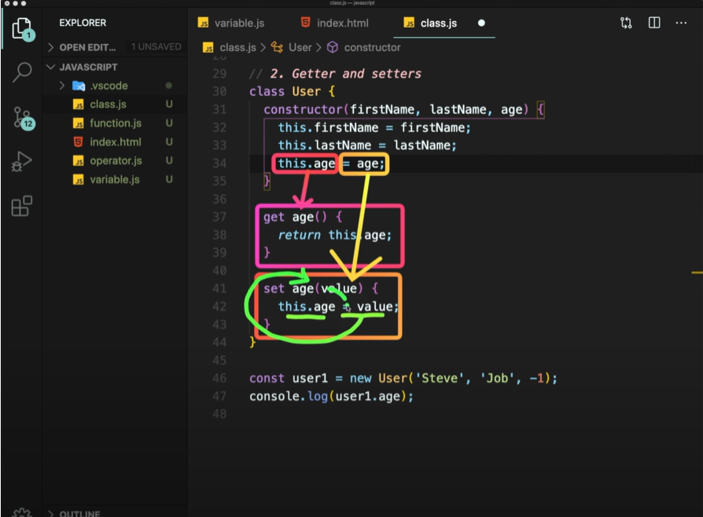

# class_object

## class (틀)

- template
- declate once
- no data in
- 

## object (내용물)

- instance of a class
- created many times
- data in


### Class declarations

```js
class Person {
    //constructor
    constructor(name, age) {
        //fields
        this.name = name;
        this.age = age;
    }
    //method
    speak() {
        console.log(`${this.name}: hello!`) // this.name : 생성된 object의 이름
    }
}

const ellie = new Person('ellie', 20);
console.log(ellie.name);
console.log(ellie.age);
ellie.speak();
```


### getter and setters




```js
class User {
    constructor(firstName, lastName, age) {
        this.firstName = firstName;
        this.lastName = lastName;
        this.age = age;
    }

    get age() {
        return this._age
    }
    set age(value) {
        this._age = value < 0 ? 0 : value; // 값이 마이너스면 0을 쓰고 아니면 값을 사용
    } // _age 이름을 다르게 하지 않으면 서로 계속 호출해서 오류가 난다.
}
const user1 = new User('Steve', 'Job', '-1');
console.log(user1.age);
```


### Fields (public, private)

```js
class Experiment {
    publicField = 2;
    #privateField = 0; // 클래스 외부에서는 읽지도 변경도 안되는 퍼블릭 필드임
}
const experiment = new Experiment();
console.log(experiment.publicField);
console.log(experiment.privateFi
```


### Static properties and method

```js
class Article {
    static publisher = 'Dream Coding';
    constructor(articleNumber) {
        this.articleNumber = articleNumber;
    }
    static printPublisher() {
        console.log(Article.publisher);
    }
}
console.log(Article.publisher)
Article.printPublisher()
// 스테틱은 오브젝트에 있는 것이 아니고 클래스 자체에 붙어있어서
//출력 시 클래스를 호출해야 함. 
```


### Inheritance  

공통된 것을 줄일 수 있음

필요한 함수만 수정해서 사용 가능

```js

class Shape {
    constructor(width, height, color) {
        this.width = width;
        this.height = height;
        this.color = color;
    }
    draw() {
        console.log(`drawing ${this.color} color of`);
    }
    getArea() {
        return this.width * this.height;
    }
}
class Rectangle extends Shape { }
class Triangle extends Shape { // 필요한 함수 재정의 가능
    getArea() {
        return (this.width * this.height) / 2;
    }
    draw() {
        super.draw();        // 원래 정의되어있던 것 가져와서 
        console.log('세모'); // 새로운 내용 추가하는 로직
    }
}

const rectangle = new Rectangle(20, 20, 'blue');
rectangle.draw();
console.log(rectangle.getArea());

const triangle = new Triangle(20, 20, 'blue');
triangle.draw();
console.log(triangle.getArea());
```


### Class checking instanceOf

```js
// 왼쪽에 있는 obj가 오른쪽에 있는 클래스의 instance인지
// 오브젝트가 클래스에 의해 만들어진건지 확인하는 것
console.log(rectangle instanceof Rectangle); // t
console.log(triangle instanceof Rectangle); // f
console.log(triangle instanceof Triangle); // t
console.log(triangle instanceof Shape); // Shape을 상속받아서 
console.log(triangle instanceof Object); // 모든 obj는 이 object를 상속한 것이다.
```

