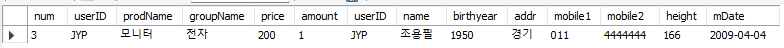

# Join

> 두 개 이상의 테이블을 서로 묶어서 하나의 결과 집합으로 만들어 내는 것을 말한다.


## INNER JOIN(내부 조인) == JOIN

형식

```mysql
SELECT 열 목록
FROM 첫 번째 테이블
	INNER JOIN 두 번째 테이블
	ON 조인될 조건
WHERE 조건
```


실습

```mysql
USE sqldb;
select * 
	from buytbl -- 이거를 기준으로 
		inner join usertbl -- 이거랑 조인할건데 
        on buytbl.userID = usertbl.userID -- userID가 같은걸로 조인해주는데
	where buytbl.userID = 'JYP'; -- userID는 JYP야
```

 


양쪽 테이블에 중복되는 열을 출력하려고 한다면 그 앞에 꼭 어떤 테이블의 열 인지를 입력한다.
 각 테이블에 별칭을 넣어서 코드를 간략하게 할 수 있다.

```mysql
select DISTINCT B.userID, U.name, U.addr
	from buytbl B -- 이거를 기준으로 
		inner join usertbl U-- 이거랑 조인할건데 
        on B.userID = U.userID; -- userID가 같은걸로 조인해주는데  
```


---


세 개의 테이블 조인 실습

```mysql
select S.stdName, S.addr, C.clubName, C.roomNo
	from stdtbl S
		inner join stdclubTbl SC
			on S.stdName = SC.stdName
		inner join clubtbl C
			on SC.clubName = C.clubName
ORDER BY S.stdName;
```

1. 학생 테이블 - 학생_동아리 테이블 조인
2. 1번과 동아리 테이블 조인


## OUTER JOIN (외부 조인)

- LEFT - 왼쪽을 기준으로 조인
- RIGHT - 오른쪽을 기준으로 조인
- FULL - 양쪽이 기준, 누락되는 데이터가 없다.

형식

```mysql
SELECT 열 목록
FROM 첫 번째 테이블
	LEFT,RIGHT,FULL OUTER JOIN 두 번째 테이블
	ON 조인될 조건
WHERE 조건
```


## CROSS JOIN

> 한쪽 테이블의 모든 행들과 다른 쪽 테이블의 모든 행을 조인
>
> 결과의 개수는 두 테이블 개수를 곱한 개수가 된다.
>
> ON절이 필요없다.

형식

```mysql
SELECT 열 목록
FROM 첫 번째 테이블
	CROSS JOIN 두 번째 테이블;
```


## SELF JOIN

> 자기 자신과 조인한다.


## UNION, UNION ALL

> 두 쿼리의 결과를 행으로 합치는 기
>
> UNION : 중복된 열을 제거한다.
>
> UNION ALL : 중복된 열까지 모두 출력한다.

```mysql
SELECT 문장 1
	UNION [ALL]
SELECT 문장 2
```

문장 1, 2 결과 열의 개수가 같아야 하고 테이터 형식도 같거나 호환이 되어야 사용할 수 있다.


## NOT IN

> NOT IN(이 결과를 뺀다)

사용 예시)

```mysql
SELECT name, is_Couple AS '커플이 아닌 사람' FROM usertbl
	WHERE name NOT IN (SELECT name FROM usertbl WHERE is_Couple = True);
-- 커플에 해당하는 사람의 이름은 제외한다.
```

