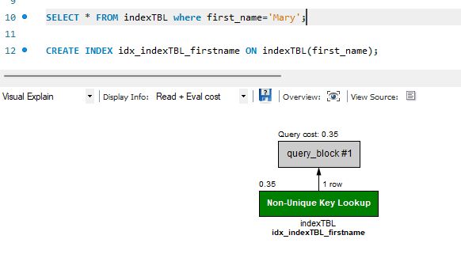

# MySQL(RDBMS)

> 관계형 DBMS이다. 오라클사에서 만들었음.
>
> 확장성이 좋다.
>
> 표준 SQL을 지키면서 MySQL의 장점을 살린 DBMS라고 할 수 있다. (표준SQL + MySQL)
>
> 표준 SQL을 잘 한다면 DBMS가 바뀌어도 잘 대응할 수 있다. (표준 SQL을 잘 하면 좋다는 얘기)


## 필수 용어

- **데이터베이스 모델링**은 현실세계의 데이터를 MySQL 에 어떻게 저장할지 생각하는 과정이다.


- DBMS: 데이터베이스 관리 시스템
- 테이블 구조 : 열(컬럼)과 행(로우)으로 구성
  - 행의 수 : 데이터 수
  - 열의 수 : 데이터 수와 관련없음
  - 기본키(PK) : 중복이 안되는 유일한 값, 비어있으면 안된다.
  - 외래키(FK) : 두 테이블의 관계를 맺어주는 키를 말한다.
- 데이터베이스 : 데이터의 저장소 (이것을 관리하는 것이 DBMS)


## 데이터베이스 구축 절차


## 인덱스

연습으로 사용할 인덱스 테이블을 생성하고 500개의 데이터를 저장하고 조회 결과

500건을 전체를 다 조회해서 찾았다고 나온다.


**인덱스 생성 후 조회**

인덱스를 사용해서 결과를 찾아냈다.

전보다 빠른 조회가 가능해진다.




## 뷰

> 가상의 테이블이다.
>
> 사용자 입장에서 테이블이 동일하게 보이지만 뷰는 실체가 없고 진짜 테이블에 링크된 개념이다.

용도

실제 데이터를 가상의 데이터로 만들어서 실제 데이터의 보안을 지키면서 여러 조작을 할 수 있게 만드는 것


관리자가 권한을 부여한 데이터만 조회가 가능하다.


## 스토어드 프로시저

> MySQL에서 제공하는 프로그래밍 기능이다.
>
> SQL문을 하나로 묶어서 편리하게 사용하는 기능이다.

```mysql
DELIMITER //
CREATE PROCEDURE myProc()
BEGIN
	이 공간에 작업할 내용을 작성한다.
	SELECT * FROM memberTBL WHERE memberName = '당당이';
	SELECT * FROM productTBL WHERE productName = '냉장고';
END // 
DELIMITER ;

사용 문법
Call myProc() 
```


## 트리거

> 테이블에 부착되어 테이블에 INSERT나  UPDATE, DELETE 작업이 발생되면 실행되는 코드이다.

A테이블에 DELETE 트리거를 설정하고 A테이블에서 DELETE 명령을 실행했다면 자동으로 트리거가 실행된다.

**실습코드**

```mysql
INSERT INTO memberTBL VALUES ('Figure', '연아', '경기도 군포시 당정동');

update memberTBL set memberAddress = '서울 강남구 역삼동' where memberName = '연아';

delete from memberTBL WHERE memberName = '연아';
select * from memberTBL;
CREATE TABLE deletedMemberTBL (
	memberID char(8),
    memberName char(5),
    memberAddress char(20),
    deleteDate date -- 삭제한 날짜
    );

트리거 생성
DELIMITER //
CREATE TRIGGER trg_deletedMemberTBL -- 트리거 이름
-- 언제 실행되는지 입력하는 란
	AFTER DELETE -- 삭제하면 자동으로 작동함
	ON memberTBL -- 트리거를 설정할 테이블
	FOR EACH ROW -- 각 행마다 적용한다.
BEGIN
	-- OLD 테이블의 내용을 백업테이블에 삽입
    INSERT INTO deletedMemberTBL -- 어떤 테이블에 넣을 것인가
		VALUES (OLD.memberID, OLD.memberName, OLD.memberAddress, CURDATE());
END // 
DELIMITER ; -- 삭제한 데이터를 deletedMemberTBL테이블에 저장하는 트리거 생성

SELECT * FROM memberTBL;

DELETE FROM memberTBL WHERE memberName = '당당이'; -- 여기서 자동으로 트리거가 실행되어

SELECT * FROM deletedMemberTBL; -- 당당이가 조회된다.
```


## 백업과 복원

**백업**: 현재의 데이터베이스를 다른 매체에 보관하는 작업

**복원**: 데이터베이스에 문제가 발생했을 때 다른 매체에 백업된 데이터를 이용해서 원상태로 돌려놓는 작업

MySQL 에서는 간단하게 백업을 할 수 있다.


