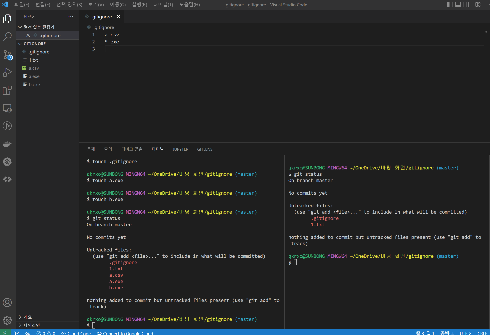

# .gitignore

비번이나 보이고싶지 않은 걸 여기에 넣으면 됨

> 이미 커밋된 파일은 수정 사항들이 깃으로 추적이 된다,
>
> 커밋 하기 전에 gitignore하는 것이 중요하다는 말

## 실습 자료

*왼쪽은 gitignore 사용전 , 오른쪽은 a.csv,.exe 입력 후*

>gitignore 파일에 들어가는 입력된 파일이나 확장자들은 확인 할 수 없음

- `touch .gitignore` 으로 생성가능

- `*.exe` : 모든 exe파일 숨김

### gitignore 링크!

[gitignore window_python link](https://www.toptal.com/developers/gitignore/api/windows,python)

친절한 개발자 선배님들이 깃에서 추적하지 않을 파일들을 모아둔 곳!!👍

혹시 다른 운영체제에 다른 언어를 사용한다면 [gitignore.io](https://www.toptal.com/developers/gitignore) 👈이 곳으로 가면 된다.

