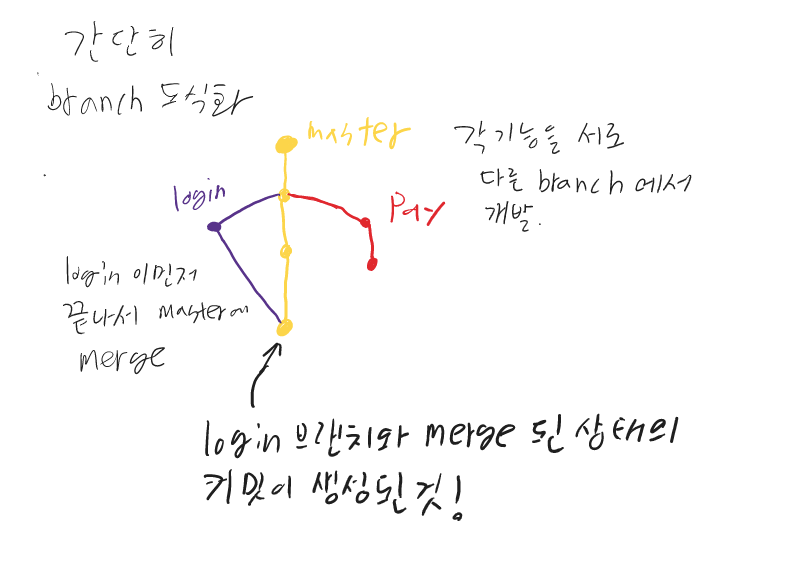

# Branch🪜

메인에 영향을 주지 않고 기존의 환경에 기능을 수정, 추가 등을 할 때 사용하는 기능같음


## 목적

독립적인 버전들을 만들어 가기 위해서 사용된다.

---


가지 치기를 시작하려면 처음 가지가 있어야함 즉, 커밋이 하나는 있어야 된다.(root-commit : 첫번째 커밋)


각 파트에서 개발한 내용을  테스트 후 사용자가 볼 수 있는(master)으로 보내 합친다.

합치는게 머지인듯

---


## Branch command

| 명령어                                | 기능                 |
| ------------------------------------- | -------------------- |
| (master) $ git branch                 | 브랜치 목록 조회     |
| (master) $ git branch {브랜치명}      | 브랜치 생성          |
| (master) $ git merge {브랜치명}       | 합친다               |
| (master) $ git branch -d {브랜치명}   | 브랜치 삭제          |
| (master) $ git checkout -b {브랜치명} | 브랜치 만들면서 이동 |
| (master) $ git checkout {브랜치명}    | 브랜치 이동          |
|                                       |                      |

### 기초 개념


- 머지할 때 마스터에 다른 가지를 합치게해야함
  - 즉, 머지 명령어는 마스터에서 입력해야한단말 주의~! 

- 마스터에 머지하고 브랜치를 지워도 사라지지않음 
  - 머지 전에 지우면 망하는거임

 

**머지를 하면 새로운 커밋이 발생하면서 합쳐진 버전이 생긴다.**

**이미 병합된 브랜치는 삭제한다.**

---

## Github Flow 기본원칙

1.  master branch 는 반드시 배포 가능한 상태여야한다.
2. feature branch는 각 기능의 의도를 알 수 있도록 작성한다.
3. Commit message는 매우 중요! 명확하게 작성해야한다.
4. Pull Request를 통해 협업을 진행
5. 변경사항을 반영하고 싶다면 master branch 에 merge


## 종류

- Feature Branch Workflow
  - 저장소에 소유권 있다(주인장)
  - 로컬에서 병합하지 않고 깃허브에서 머지하고 그것을 pull받아서 다음 작업으로 넘어간다고 생각하면됨

Q. 왜 이렇게 하나요?

​		협업 하는 사람들의 각자의 작업이 끝나면 merge 작업을 원격 저장소에서 하기 위함이다.. 


- Forking Workflow

  - 저장소에 소유권이 없다(손님)

  - 초대받지 못한 손님은 머지는 불가능(소유권이 없으니 못한다는 말)

    

     

---

## 흐름

1. 처음 시작은 1개의 master 커밋이 있어야 한다.
2. git branch 브랜치명 으로 생성 
3. git checkout 브랜치명 으로 이동
4. 작업~~
5. add . / commit 으로 커밋 
6. git checkout master 이동
7. (master) $ git  merge 브랜치명
8. 가지가 합쳐진 master의 새로운 커밋이 생성
9. git branch -d 브랜치명  으로 삭제한다. 


## 도식화



---

### merge 연습


```bash
qkrxo@SUNBONG MINGW64 ~/OneDrive/바탕 화면/머지연습 (master)
$ git log --oneline --graph
*   ca8e95d (HEAD -> master) Merge branch 'example' 해야함
|\
| * e63513b (example) 수정
* | 10f7d09 파일만듬
|/
* 5747849 addfile
* 2921010 add 2.txt
* d5bfc8f add

```

